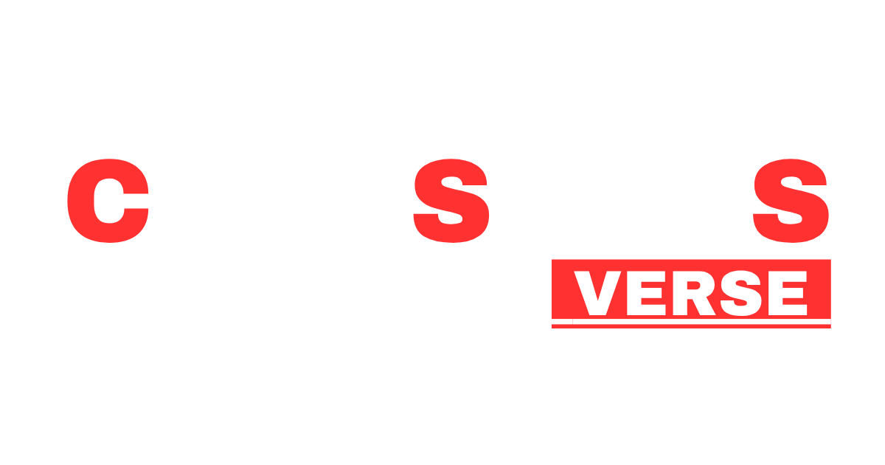

<div dir="rtl">

# 🎨 عالم سي.اس.اس — CSSVerse

<p align="center">
  
</p>

<p align="center">
  <strong>منصة تعليمية عربية حرة ومفتوحة المصدر لتعلّم CSS وتصميم صفحات الويب.</strong>
</p>

<p align="center">
  🎨 <strong>تعلّم CSS • صمّم • طوّر • ابتكر</strong>
</p>

<p align="center">
  <a href="#-حول-المشروع">حول المشروع</a> •
  <a href="#-المحتوى">المحتوى</a> •
  <a href="#-رحلة-التعلم">رحلة التعلم</a> •
  <a href="#-المساهمة">المساهمة</a> •
  <a href="#-الترخيص">الترخيص</a>
</p>

---

## 🎨 حول المشروع

**عالم سي.اس.اس — CSSVerse** هو مشروع تعليمي عربي **حر ومفتوح المصدر** يهدف إلى تقديم CSS بطريقة **بسيطة، منظمة، وتدريجية**، بدايةً من المفاهيم الأساسية وصولًا إلى بناء واجهات ويب حديثة ومتجاوبة.

**CSS** هي اختصار لـ **Cascading Style Sheets**، وتعني **أوراق الأنماط المتتالية**. وهي اللغة الأساسية المستخدمة لتنسيق صفحات الويب وإعطائها مظهرًا جذابًا ومنظمًا.

من خلال CSS يمكننا التحكم في:

* 🎨 الألوان والخلفيات.
* 🔤 الخطوط والنصوص.
* 📏 الأحجام والمسافات.
* 📦 أبعاد العناصر.
* ↔️ التخطيطات.
* ✨ الحركات والتأثيرات.
* 📱 التصميم المتجاوب.
* 🖥️ دعم مختلف أحجام الشاشات.

---

## 🌐 لماذا CSS؟

ظهرت CSS بهدف **فصل محتوى صفحات الويب وهيكلها** الذي توفره HTML عن **طريقة عرض هذا المحتوى وتنسيقه**.

ومع تطور الويب، أصبحت CSS أكثر قوة ومرونة، وظهرت تقنيات ومفاهيم حديثة مثل:

**Flexbox • Grid • Media Queries • Animations • Custom Properties**

هذه الأدوات جعلت من الممكن إنشاء واجهات ويب حديثة، مرنة، ومتجاوبة مع مختلف الأجهزة.

> 💡 **لا تحتاج إلى أن تكون خبيرًا في البرمجة لتبدأ تعلّم CSS.**

فهم طريقة كتابة القواعد، واختيار العناصر، وتغيير الألوان والخطوط، والتحكم في المسافات والأبعاد، وبناء التخطيطات يمنحك أساسًا قويًا لإنشاء صفحات ويب جميلة ومنظمة.

---

## 🎯 الهدف

يهدف **CSSVerse** إلى إنشاء مصدر عربي مفتوح يساعد على تعلّم CSS بطريقة عملية ومنظمة.

يبدأ المشروع من **المفاهيم الأساسية** ثم ينتقل تدريجيًا إلى:

```text
🎨 أساسيات CSS
      ↓
🔎 Selectors
      ↓
📦 Box Model
      ↓
↔️ Flexbox
      ↓
▦ CSS Grid
      ↓
📱 Responsive Design
      ↓
✨ Transitions & Animations
      ↓
🎛️ CSS Variables
      ↓
🧩 Pseudo-classes & Pseudo-elements
      ↓
🚀 واجهات ويب حديثة
```

---

## 📘 المحتوى

### 🎨 أساسيات CSS

* مقدمة إلى CSS.
* مفهوم Cascading.
* كيفية عمل CSS.
* كتابة قواعد CSS.
* ربط CSS بصفحات HTML.

### 🔎 المحددات — Selectors

* Element Selectors.
* Class Selectors.
* ID Selectors.
* Attribute Selectors.
* Combinators.
* Selectors المتقدمة.

### 🎨 الألوان والخلفيات والحدود

* الألوان.
* الخلفيات.
* الصور كخلفيات.
* الحدود.
* Border Radius.
* الظلال.

### 🔤 النصوص والخطوط

* تنسيق النصوص.
* أحجام الخطوط.
* أنواع الخطوط.
* محاذاة النصوص.
* المسافات بين الكلمات والحروف.
* Web Fonts.

### 📏 الأحجام والمسافات — Box Model

* Width و Height.
* Margin.
* Padding.
* Border.
* Box Sizing.
* فهم نموذج الصندوق.

### 📦 العرض والموضع

* `display`
* `position`
* `static`
* `relative`
* `absolute`
* `fixed`
* `sticky`
* `z-index`
* التحكم في العناصر.

### ↔️ Flexbox

* مفهوم Flexbox.
* Flex Container.
* Flex Items.
* الاتجاهات.
* المحاذاة.
* توزيع المساحات.
* بناء التخطيطات المرنة.

### ▦ CSS Grid

* مفهوم Grid.
* Grid Container.
* Rows و Columns.
* Grid Areas.
* التحكم في المساحات.
* بناء التخطيطات المتقدمة.

### 📱 Responsive Design

* مفهوم التصميم المتجاوب.
* تصميم المواقع للهواتف.
* الأجهزة اللوحية.
* شاشات الحاسوب.
* بناء واجهات تتكيف مع حجم الشاشة.

### 🖥️ Media Queries

* `@media`
* Breakpoints.
* استهداف أحجام الشاشات المختلفة.
* إنشاء تصاميم متعددة للأجهزة.

### ✨ Transitions & Animations

* Transitions.
* Transform.
* Keyframes.
* Animations.
* إنشاء تأثيرات وحركات سلسة.

### 🎛️ CSS Variables

* Custom Properties.
* إنشاء المتغيرات.
* استخدام المتغيرات.
* تنظيم قيم التصميم.
* بناء Design Systems بسيطة.

### 🧩 Pseudo-classes & Pseudo-elements

* Pseudo-classes.
* Pseudo-elements.
* `:hover`
* `:focus`
* `:active`
* `::before`
* `::after`

### 🛠️ أفضل الممارسات

* تنظيم ملفات CSS.
* كتابة CSS نظيف.
* تسمية Classes بطريقة مناسبة.
* تقليل التكرار.
* إعادة استخدام الأنماط.
* كتابة CSS قابل للصيانة.

### 💡 للمبتدئين

نصائح وممارسات عملية تساعدك على تطوير مهاراتك في CSS وبناء صفحات ويب أفضل.

---

## 🗺️ رحلة التعلم

| المستوى   | الموضوع                          |
| --------- | -------------------------------- |
| 🟢 **01** | مقدمة إلى CSS                    |
| 🟢 **02** | Selectors                        |
| 🟢 **03** | Colors & Backgrounds             |
| 🟢 **04** | Text & Fonts                     |
| 🟡 **05** | Box Model                        |
| 🟡 **06** | Display & Position               |
| 🟡 **07** | Flexbox                          |
| 🟠 **08** | CSS Grid                         |
| 🟠 **09** | Responsive Design                |
| 🟠 **10** | Media Queries                    |
| 🔵 **11** | Transitions & Animations         |
| 🔵 **12** | CSS Variables                    |
| 🔵 **13** | Pseudo-classes & Pseudo-elements |
| 🔵 **14** | Best Practices                   |

---

## ✨ لماذا CSSVerse؟

| الميزة                  | الوصف                        |
| ----------------------- | ---------------------------- |
| 🇦🇪 **باللغة العربية** | محتوى CSS باللغة العربية     |
| 🎓 **للمبتدئين**        | يبدأ من الصفر                |
| 🧩 **منظم**             | التعلم بشكل تدريجي           |
| 💻 **عملي**             | التركيز على الاستخدام الفعلي |
| 📱 **حديث**             | يشمل Responsive Design       |
| 🌐 **مفتوح المصدر**     | يمكن للجميع المساهمة         |
| 🆓 **حر**               | المعرفة متاحة للجميع         |

---

## 🚀 ابدأ التعلم

إذا كنت جديدًا على CSS، ابدأ من الأساسيات وتقدم خطوة بخطوة.

> 🔍 **لا تتعلم CSS لحفظ الخصائص فقط، بل لتفهم كيف تبني وتصمم واجهات الويب.**

---

## 🤝 المساهمة

**CSSVerse** مشروع مفتوح المصدر، ونرحب بكل من يرغب في المساهمة في تطوير المحتوى العربي.

يمكنك المساهمة من خلال:

* 📝 تحسين المحتوى.
* 🐛 الإبلاغ عن الأخطاء.
* 💡 اقتراح مواضيع جديدة.
* 📚 إضافة أمثلة تعليمية.
* 🎨 تحسين التصميم.
* 💻 المساهمة في الكود.
* 🌐 تحسين المحتوى العربي.

### 🔧 المساهمة بالكود

```bash
# استنساخ المشروع
git clone https://github.com/openarabtech/CSSVerse.git

# الانتقال إلى مجلد المشروع
cd CSSVerse

# إنشاء فرع جديد
git checkout -b feature/my-contribution

# إضافة التعديلات
git add .

# إنشاء Commit
git commit -m "Add: my contribution"

# رفع الفرع
git push origin feature/my-contribution
```

بعد ذلك يمكنك إنشاء **Pull Request** للمشروع.

---

## 🌍 المصدر المفتوح

هذا المشروع مفتوح للجميع للمشاركة والتطوير والمساهمة في نشر المعرفة التقنية باللغة العربية.

نؤمن بأن **المعرفة التقنية يجب أن تكون متاحة للجميع**، وأن المحتوى العربي يمكن أن يكون جزءًا أساسيًا من مستقبل الويب.

---

## 📜 الترخيص

هذا المشروع مرخّص بموجب **رخصة MIT**.

تتيح رخصة MIT استخدام المشروع وتعديله ونسخه وتوزيعه بحرية، وفق شروط الرخصة.

---

## 🌐 المجتمع

CSSVerse جزء من جهود نشر المعرفة التقنية باللغة العربية ودعم المشاريع العربية مفتوحة المصدر.

مدعوم من منظمة:

**[Open Arab Tech — التقنية العربية المفتوحة](https://www.linkedin.com/company/openarabtech/)**

---

## 📌 معلومات المشروع

|                   |                |
| ----------------- | -------------- |
| **اسم المشروع**   | CSSVerse       |
| **الاسم العربي**  | عالم سي.اس.اس  |
| **التقنية**       | CSS            |
| **اللغة**         | العربية 🇦🇪   |
| **النوع**         | مشروع تعليمي   |
| **المصدر**        | مفتوح المصدر   |
| **الترخيص**       | MIT            |
| **الجهة الداعمة** | Open Arab Tech |

---

## ⭐ ادعم CSSVerse

إذا وجدت المشروع مفيدًا، يمكنك دعمه من خلال:

⭐ وضع **Star** للمستودع
🐛 الإبلاغ عن الأخطاء
💡 اقتراح أفكار جديدة
🤝 المساهمة في المحتوى
📢 مشاركة المشروع

> **كل مساهمة تساعد في بناء محتوى تقني عربي أفضل.**

---

<p align="center">

# 🎨 CSSVerse

### عالم سي.اس.اس

**تعلّم • صمّم • طوّر • ابتكر**

© 2026 CSSVerse

</p>

</div>